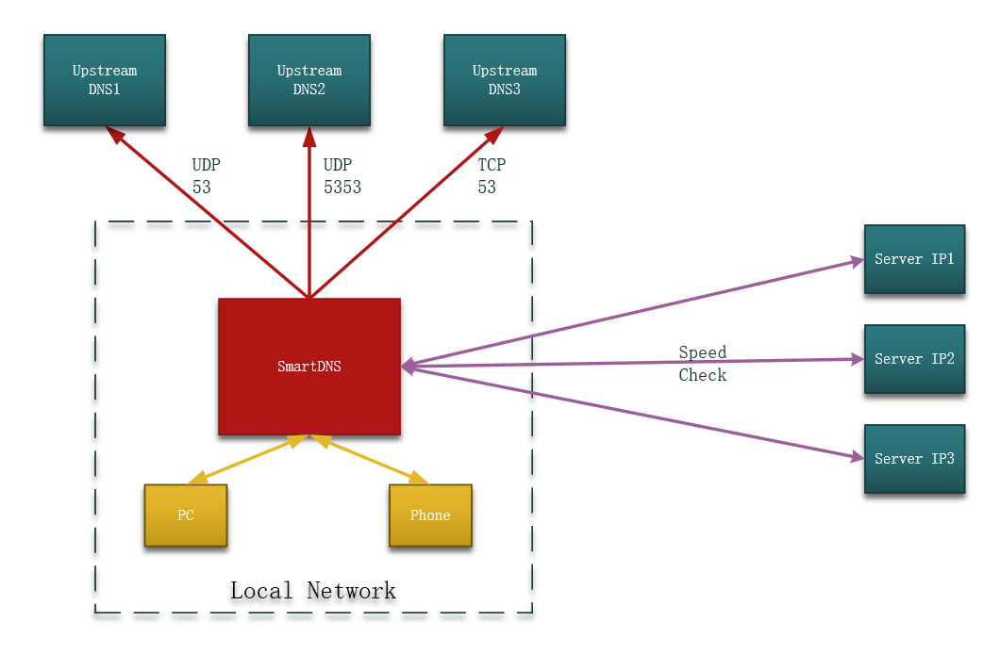

# SmartDNS

  
SmartDNS is a local DNS server. SmartDNS accepts DNS query requests from local clients, obtains DNS query results from multiple upstream DNS servers, and returns the fastest access results to clients.  
Avoiding DNS pollution and improving network access speed, supports high-performance ad filtering.  
Unlike dnsmasq's all-servers, smartdns returns the fastest access resolution. （[read more](#faq)）

Support Raspberry Pi, openwrt, ASUS router, Windows and other devices.  

## Table Of Content

1. [Software Show](#software-show)
1. [Features](#features)
1. [Architecture](#architecture)
1. [Usage](#usage)  
    1. [Download the package](#download-the-package)
    1. [Standard Linux system installation/Raspberry Pi, X86_64 system](#standard-linux-system-installation/raspberry-pi,-x86_64-system)
    1. [openwrt/LEDE](#openwrt/lede)
    1. [ASUS router native firmware / Merlin firmware](#asus-router-native-firmware-/-merlin-firmware)
    1. [optware/entware](#optware/entware)
    1. [Windows 10 WSL Installation/WSL ubuntu](#windows-10-wsl-installation/wsl-ubuntu)
1. [Configuration parameter](#configuration-parameter)
1. [Donate](#Donate)
1. [FAQ](#FAQ)

## Software Show

**Ali DNS**  
Use Ali DNS to query Baidu's IP and test the results.  

```shell
pi@raspberrypi:~/code/smartdns_build $ nslookup www.baidu.com 223.5.5.5
Server:         223.5.5.5
Address:        223.5.5.5#53

Non-authoritative answer:
www.baidu.com   canonical name = www.a.shifen.com.
Name:   www.a.shifen.com
Address: 180.97.33.108
Name:   www.a.shifen.com
Address: 180.97.33.107

pi@raspberrypi:~/code/smartdns_build $ ping 180.97.33.107 -c 2
PING 180.97.33.107 (180.97.33.107) 56(84) bytes of data.
64 bytes from 180.97.33.107: icmp_seq=1 ttl=55 time=24.3 ms
64 bytes from 180.97.33.107: icmp_seq=2 ttl=55 time=24.2 ms

--- 180.97.33.107 ping statistics ---
2 packets transmitted, 2 received, 0% packet loss, time 1001ms
rtt min/avg/max/mdev = 24.275/24.327/24.380/0.164 ms
pi@raspberrypi:~/code/smartdns_build $ ping 180.97.33.108 -c 2
PING 180.97.33.108 (180.97.33.108) 56(84) bytes of data.
64 bytes from 180.97.33.108: icmp_seq=1 ttl=55 time=31.1 ms
64 bytes from 180.97.33.108: icmp_seq=2 ttl=55 time=31.0 ms

--- 180.97.33.108 ping statistics ---
2 packets transmitted, 2 received, 0% packet loss, time 1001ms
rtt min/avg/max/mdev = 31.014/31.094/31.175/0.193 ms
```

**smartdns**  
Use SmartDNS to query Baidu IP and test the results.

```shell
pi@raspberrypi:~/code/smartdns_build $ nslookup www.baidu.com
Server:         192.168.1.1
Address:        192.168.1.1#53

Non-authoritative answer:
www.baidu.com   canonical name = www.a.shifen.com.
Name:   www.a.shifen.com
Address: 14.215.177.39

pi@raspberrypi:~/code/smartdns_build $ ping 14.215.177.39 -c 2
PING 14.215.177.39 (14.215.177.39) 56(84) bytes of data.
64 bytes from 14.215.177.39: icmp_seq=1 ttl=56 time=6.31 ms
64 bytes from 14.215.177.39: icmp_seq=2 ttl=56 time=5.95 ms

--- 14.215.177.39 ping statistics ---
2 packets transmitted, 2 received, 0% packet loss, time 1001ms
rtt min/avg/max/mdev = 5.954/6.133/6.313/0.195 ms

```

From the comparison, smartdns found the fastest IP address to visit www.baidu.com, so accessing Baidu's DNS is 5 times faster than Ali DNS.

## Features

1. **Multiple upstream DNS servers**  
   Support configuring multiple upstream DNS servers and query at the same time.the query will not be affected, Even if there is a DNS server exception.  

2. **Return the fastest IP address**  
   Supports finding the fastest access IP address from the IP address list of the domain name and returning it to the client to avoid DNS pollution and improve network access speed.

3. **Support for multiple query protocols**  
   Support UDP, TCP, TLS, HTTPS queries, and non-53 port queries, effectively avoiding DNS pollution.

4. **Domain IP address specification**  
   Support configuring IP address of specific domain to achieve the effect of advertising filtering, and avoid malicious websites.

5. **Domain name high performance rule filtering**  
   Support domain name suffix matching mode, simplify filtering configuration, filter 200,000 recording and take time <1ms.

6. **Linux/Windows multi-platform support**  
   Support standard Linux system (Raspberry Pi), openwrt system various firmware, ASUS router native firmware. Support Windows 10 WSL (Windows Subsystem for Linux).

7. **Support IPV4, IPV6 dual stack**  
   Support IPV4, IPV6 network, support query A, AAAA record, dual-stack IP selection, and disale IPV6 AAAA record.

8. **High performance, low resource consumption**  
   Multi-threaded asynchronous IO mode, cache cache query results.

## Architecture



1. SmartDNS receives DNS query requests from local network devices, such as PCs and mobile phone query requests.
2. SmartDNS sends query requests to multiple upstream DNS servers, using standard UDP queries, non-standard port UDP queries, and TCP queries.
3. The upstream DNS server returns a list of Server IP addresses corresponding to the domain name. SmartDNS detects the fastest Server IP with local network access.
4. Return the fastest accessed Server IP to the local client.

## Usage

### Download the package

--------------

Download the matching version of the SmartDNS installation package. The corresponding installation package is as follows.

|system |package|Description
|-----|-----|-----
|Standard Linux system (Raspberry Pi)| smartdns.xxxxxxxx.arm-debian-all.deb|Support Raspberry Pi Raspbian stretch, Debian 9 system.
|Standard Linux system (Armbian arm64)| smartdns.xxxxxxxx.aarch64-debian-all.deb|Support Armbian debian stretch, Debian 9 system.
|Standard Linux system (x86_64)| smartdns.xxxxxxxx.x86_64-linux-all.tar.gz|Support for x86_64 Linux systems.
|Windows 10 WSL (ubuntu)| smartdns.xxxxxxxx.x86_64-linux-all.tar.gz|Windows 10 WSL ubuntu.
|Standard Linux system (x86)| smartdns.xxxxxxxx.x86-linux-all.tar.gz|Support for x86_64 systems.
|optware|smartdns.xxxxxxxx.mips-optware-all.ipk|Support the MIPS big-endian architecture for optware。
|optware|smartdns.xxxxxxxx.mipsel-optware-all.ipk|Support the MIPS little-endian architecture for optware。
|optware|smartdns.xxxxxxxx.arm-optware-all.ipk|Support the arm architecture for optware。
|openwrt|smartdns.xxxxxxxx.mips-openwrt-all.ipk|Support the MIPS big-endian architecture for openwrt。
|openwrt|smartdns.xxxxxxxx.mipsel-openwrt-all.ipk|Support the MIPS little-endian architecture for openwrt。
|openwrt|smartdns.xxxxxxxx.arm-openwrt-all.ipk|Support the arm architecture for openwrt。
|openwrt LUCI|luci-app-smartdns.xxxxxxxxx.all.ipk|Openwrt management interface.
|openwrt LUCI|luci-app-smartdns.xxxxxxxxx.all-luci-compat-all|Compat Openwrt management interface for early openwrt.

* The released packages are statically compiled. If you need a small size package, please compile it yourself or obtain it from the openwrt / entware repository.

* **Please download from the Release page: [Download here](https://github.com/pymu/smartdns/releases)**

```shell
https://github.com/pymumu/smartdns/releases
```

* For the installation procedure, please refer to the following sections.

### Standard Linux system installation/Raspberry Pi, X86_64 system

--------------

1. Installation

    Download the installation package like `smartdns.xxxxxxxx.arm-debian-all.deb` and upload it to the Linux system. Run the following command to install

    ```shell
    dpkg -i smartdns.xxxxxxxx.arm-debian-all.deb
    ```

    For X86-64 system, download the installation package like `smartdns.xxxxxxxx.x86_64-linux-all.tar.gz` and upload it to the Linux system. Run the following command to install

    ```shell
    tar zxf smartdns.xxxxxxxx.x86_64-linux-all.tar.gz
    cd smartdns
    chmod +x ./install
    ./install -i
    ```

1. Configuration

    After the installation is complete, you can configure the upstream server to  smartdns. Refer to the `Configuration Parameters` for specific configuration parameters.  
    In general, you only need to add `server [IP]:port`, `server-tcp [IP]:port` configuration items.  
    Configure as many upstream DNS servers as possible, including servers at home and abroad. Please refer to the `Configuration Parameters` section for configuration parameters.  

    ```shell
    vi /etc/smartdns/smartdns.conf
    ```

1. Start Service

    ```shell
    systemctl enable smartdns
    systemctl start smartdns
    ```

1. Forwarding DNS request to SmartDNS

    Modify the DNS server of the local router and configure the DNS server as SmartDNS.
    * Log in to the router on the local network and configure the Raspberry Pi to assign a static IP address.
    * Modify the WAN port or DHCP DNS to the Raspberry Pi IP address.
    Note:
    I. Each router configuration method is different. Please search Baidu for related configuration methods.
    II. some routers may not support configuring custom DNS server. in this case, please modify the PC's, mobile phone's DNS server to the ip of Raspberry Pi.

1. Check if the service is configured successfully

    Query domain name with `nslookup -querytype=ptr smartdns`  
    Check if the `name` item in the command result is displayed as `smartdns` or `hostname`, such as `smartdns`

    ```shell
    pi@raspberrypi:~/code/smartdns_build $ nslookup -querytype=ptr smartdns
    Server:         192.168.1.1
    Address:        192.168.1.1#53

    Non-authoritative answer:
    smartdns         name = smartdns.
    ```

### openwrt

--------------

1. Installation

    Upload the software to the /root directory of the router with winscp or other tool, and execute the following command to install it.

    ```shell
    opkg install smartdns.xxxxxxxx.xxxx.ipk
    opkg install luci-app-smartdns.xxxxxxxx.xxxx.all.ipk
    ```

    * Note: For versions before openwrt 19.07, please install `luci-app-smartdns.xxxxxxxxx.all-luci-compat-all` package.

1. Configuration

    Log in to the openwrt management page and open `Services`->`SmartDNS` to configure SmartDNS.
    * Add upstream DNS server configuration to `Upstream Servers`. It is recommended to configure multiple DNS servers at home and abroad.
    * Specify the IP address of a specific domain name in `Domain Address`, which can be used for ad blocking.

1. Start Service

   There are two ways to use the SmartDNS service, `one is directly as the primary DNS service`, `the other is as the upstream of dnsmasq`.  
   By default, SmartDNS uses the first method. You can choose according to your needs in the following two ways.

1. Method 1: SmartDNS as primary DNS Server (default scheme)

    * **Enable SmartDNS port 53 port redirection**

        Log in to the router, click on `Services`->`SmartDNS`->`redirect`, select `Redirect 53 port to SmartDNS` option to enable port 53 forwarding.

    * **Check if the service is configured successfully**

        Query domain name with `nslookup -querytype=ptr smartdns`
        See if the `name` item in the command result is displayed as `smartdns` or `hostname`, such as `smartdns`

        ```shell
        pi@raspberrypi:~/code/smartdns_build $ nslookup -querytype=ptr smartdns
        Server:         192.168.1.1
        Address:        192.168.1.1#53

        Non-authoritative answer:
        smartdns         name = smartdns.
        ```

    * **The interface prompts that the redirect failed**

        * Check if iptable, ip6table command is installed correctly.
        * The openwrt 15.01 system does not support IPV6 redirection. If the network needs to support IPV6, please change DNSMASQ upstream to smartdns, or change the smartdns port to 53, and disable dnsmasq.
        * After LEDE system, please install IPV6 nat forwarding driver. Click `system`->`Software`, click `update lists` to update the software list, install `ip6tables-mod-nat`
        * Use the following command to check whether the routing rule takes effect.

        ```shell
        iptables -t nat -L PREROUTING | grep REDIRECT
        ```

        * If the forwarding function is abnormal, please use Method 2: As the upstream of DNSMASQ.

1. Method 2: SmartDNS as upstream DNS Server of DNSMASQ

    * **Forward dnsmasq's request to SmartDNS**

        Log in to the router, click on `Services`->`SmartDNS`->`redirect`, select `Run as dnsmasq upstream server` option to forwarding dnsmasq request to Smartdns.

    * **Check if the service is configured successfully**

        * Method 1: Query domain name with `nslookup -querytype=ptr 0.0.0.1`
        See if the `name` item in the command result is displayed as `smartdns` or `hostname`, such as `smartdns`

        ```shell
        pi@raspberrypi:~/code/smartdns_build $ nslookup -querytype=ptr smartdns
        Server:         192.168.1.1
        Address:        192.168.1.1#53

        Non-authoritative answer:
        smartdns         name = smartdns.
        ```

        * Method 2: Use `nslookup` to query the `www.baidu.com` domain name to see if the IP address of Baidu in the result is `only one. If there are multiple IP addresses returned, it means that it is not valid. Please try to check several domain names.

        ```shell
        pi@raspberrypi:~ $ nslookup www.baidu.com 192.168.1.1
        Server:         192.168.1.1
        Address:        192.168.1.1#53

        Non-authoritative answer:
        www.baidu.com   canonical name = www.a.shifen.com.
        Name:   www.a.shifen.com
        Address: 14.215.177.38
        ```

1. Start Service

    Check the `Enable' in the configuration page to start SmartDNS server.

1. Note

    * If chinaDNS is already installed, it is recommended to configure the upstream of chinaDNS as SmartDNS.
    * SmartDNS defaults to forwarding port 53 requests to the local port of SmartDNS, controlled by the `Redirect` configuration option.

### ASUS router native firmware / Merlin firmware

--------------

Note: Merlin firmware is derived from ASUS firmware and can theoretically be used directly with the ASUS package. However, it is currently unverified. If you have any questions, please submit an issue.

1. Prepare

    When using this software, you need to confirm whether the router supports U disk and prepare a USB disk.

1. Enable SSH login

    Log in to the management interface, click `System Management`-> Click `System Settings` and configure `Enable SSH` to `Lan Only`.  
    The SSH login username and password are the same as the management interface.

1. Insstall `Download Master`

    In the management interface, click `USB related application`-> click `Download Master` to download.  
    After the download is complete, enable `Download Master`. If you do not need the download function, you can uninstall `Download Master` here, but make sure that Download Master is enabled before uninstalling.  

1. Install SmartDNS

    Upload the software to the router's `/tmp/mnt/sda1` directory using winscp. (or copy the network neighborhood to the sda1 shared directory)

    ```shell
    ipkg install smartdns.xxxxxxx.mipsbig.ipk
    ```

1. Restart router

    After the router is started, use `nslookup -querytype=ptr smartdns` to query the domain name.  
    See if the `name` item in the command result is displayed as `smartdns` or `hostname`, such as `smartdns`

    ```shell
    pi@raspberrypi:~/code/smartdns_build $ nslookup -querytype=ptr smartdns
    Server:         192.168.1.1
    Address:        192.168.1.1#53

    Non-authoritative answer:
    smartdns         name = smartdns.
    ```

1. Note

    In the above process, smartdns will be installed to the root directory of the U disk and run in optware mode.  
    Its directory structure is as follows: (only smartdns related files are listed here)

    ```shell
    USB DISK
    └── asusware.mipsbig
            ├── bin
            ├── etc
            |    ├── smartdns
            |    |     └── smartdns.conf
            |    └── init.d
            |          └── S50smartdns
            ├── lib
            ├── sbin
            ├── usr
            |    └── sbin
            |          └── smartdns
            ....
    ```

    To modify the configuration, you can use ssh to login to the router and use the vi command to modify it.

    ```shell
    vi /opt/etc/smartdns/smartdns.conf
    ```

    It can also be modified from Network Neighborhood. From the neighbor sharing directory `sda1` you can't see the `asusware.mipsbig` directory, but you can directly enter `asusware.mipsbig\etc\init.d` in `File Manager` to modify it.

    ```shell
    \\192.168.1.1\sda1\asusware.mipsbig\etc\init.d
    ```

### optware/entware

--------------

1. Prepare

    When using this software, you need to confirm whether the router supports USB disk and prepare a USB disk.

1. Install SmartDNS

    Upload the software to `/tmp` directory of the router using winscp, and run the flollowing command to install.

    ```shell
    ipkg install smartdns.xxxxxxx.mipsbig.ipk
    ```

1. Modify the smartdns configuration

    ```shell
    Vi /opt/etc/smartdns/smartdns.conf
    ```

    Note: if you need to support IPV6, you can set the worke-mode to `2`, this will disable the DNS service of dnsmasq, and smartdns run as the primary DNS server. Change `SMARTDNS_WORKMODE` in the file `/opt/etc/smartdns/smartdns-opt.conf` to 2.

    ```shell
    SMARTDNS_WORKMODE="2"
    ```

1. Restart the router to take effect

    After the router is started, use `nslookup -querytype=ptr smartdns` to query the domain name.
    See if the `name` item in the command result is displayed as `smartdns` or `hostname`, such as `smartdns`

    ```shell
    Pi@raspberrypi:~/code/smartdns_build $ nslookup -querytype=ptr smartdns
    Server: 192.168.1.1
    Address: 192.168.1.1#53

    Non-authoritative answer:
    smartdns        name = smartdns.
    ```

    Note: If the service does not start automatically, you need to set optwre/entware to start automatically. For details, see the optware/entware documentation.

### Windows 10 WSL Installation/WSL ubuntu

--------------

1. Install Windows 10 WSL ubuntu

   Install the Windows 10 WSL environment and select Ubuntu as default distribution. Please refer to [WSL installation instructions](https://docs.microsoft.com/en-us/windows/wsl/install-win10) for installation steps

1. Install smartdns

    download install package `smartdns.xxxxxxxx.x86_64-linux-all.tar.gz`，and unzip to the `D:\` directory, after decompression, the directory is as follows: 

    ```shell
    D:\SMARTDNS
    ├─etc
    │  ├─default
    │  ├─init.d
    │  └─smartdns
    ├─package
    │  └─windows
    ├─src
    └─systemd

    ```

    Double-click `install.bat` in the `D:\smartdns\package\windows` directory for installation. Please enter the password for `WLS ubuntu` when input password.

1. Configuration

    Edit `smartdns.conf` configuration file in `D:\smartdns\etc\smartdns` directory, you can configure the upstream server to  smartdns. Refer to the `Configuration Parameters` for specific configuration parameters.  
    In general, you only need to add `server [IP]:port`, `server-tcp [IP]:port` configuration items.  
    Configure as many upstream DNS servers as possible, including servers at home and abroad. Please refer to the `Configuration Parameters` section for configuration parameters.  

1. Start Service

    Double-click `reload.bat` in the `D:\smartdns\package\windows` directory for reload.

1. Forwarding DNS request to SmartDNS

    Modify the default DNS server for Windows to `127.0.0.1`, with these steps referred to [IP configuration](https://support.microsoft.com/en-us/help/15089/windows-change-tcp-ip-settings)

1. Check if the service is configured successfully

    Query domain name with `nslookup -querytype=ptr smartdns`  
    Check if the `name` item in the command result is displayed as `smartdns` or `hostname`, such as `smartdns`

    ```shell
    pi@raspberrypi:~/code/smartdns_build $ nslookup -querytype=ptr smartdns
    Server:         192.168.1.1
    Address:        192.168.1.1#53

    Non-authoritative answer:
    smartdns         name = smartdns.
    ```

## Configuration parameter

|parameter|Parameter function|Default value|Value type|Example|
|--|--|--|--|--|
|server-name|DNS name|host name/smartdns|any string like hosname|server-name smartdns
|bind|DNS listening port number|[::]:53|Support binding multiple ports<br>`IP:PORT`: server IP, port number. <br>`[-group]`: The DNS server group used when requesting. <br>`[-no-rule-addr]`: Skip the address rule. <br>`[-no-rule-nameserver]`: Skip the Nameserver rule. <br>`[-no-rule-ipset]`: Skip the Ipset rule. <br>`[-no-rule-soa]`: Skip address SOA(#) rules.<br>`[-no-dualstack-selection]`: Disable dualstack ip selection.<br>`[-no-speed-check]`: Disable speed measurement. <br>`[-no-cache]`: stop caching |bind :53
|bind-tcp|TCP mode DNS listening port number|[::]:53|Support binding multiple ports<br>`IP:PORT`: server IP, port number. <br>`[-group]`: The DNS server group used when requesting. <br>`[-no-rule-addr]`: Skip the address rule. <br>`[-no-rule-nameserver]`: Skip the Nameserver rule. <br>`[-no-rule-ipset]`: Skip the Ipset rule. <br>`[-no-rule-soa]`: Skip address SOA(#) rules.<br>`[-no-dualstack-selection]`: Disable dualstack ip selection.<br>`[-no-speed-check]`: Disable speed measurement. <br>`[-no-cache]`: stop caching |bind-tcp :53
|cache-size|Domain name result cache number|512|integer|cache-size 512
|cache-persist|enable persist cache|Auto: Enabled if the location of `cache-file` has more than 128MB of free space.|[yes\|no]|cache-persist yes
|cache-file|cache persist file|/tmp/smartdns.cache|路径|cache-file /tmp/smartdns.cache
|tcp-idle-time|TCP connection idle timeout|120|integer|tcp-idle-time 120
|rr-ttl|Domain name TTL|Remote query result|number greater than 0|rr-ttl 600
|rr-ttl-min|Domain name Minimum TTL|Remote query result|number greater than 0|rr-ttl-min 60
|rr-ttl-max|Domain name Maximum TTL|Remote query result|number greater than 0|rr-ttl-max 600
|log-level|log level|error|fatal,error,warn,notice,info,debug|log-level error
|log-file|log path|/var/log/smartdns.log|File Pah|log-file /var/log/smartdns.log
|log-size|log size|128K|number+K,M,G|log-size 128K
|log-num|archived log number|2|Integer|log-num 2
|audit-enable|audit log enable|no|[yes\|no]|audit-enable yes
|audit-file|audit log file|/var/log/smartdns-audit.log|File Path|audit-file /var/log/smartdns-audit.log
|audit-size|audit log size|128K|number+K,M,G|audit-size 128K
|audit-num|archived audit log number|2|Integer|audit-num 2
|conf-file|additional conf file|None|File path|conf-file /etc/smartdns/smartdns.more.conf
|server|Upstream UDP DNS server|None|Repeatable <br>`[ip][:port]`: Server IP, port optional. <br>`[-blacklist-ip]`: The "-blacklist-ip" parameter is to filtering IPs which is configured by "blacklist-ip". <br>`[-whitelist-ip]`: whitelist-ip parameter specifies that only the IP range configured in whitelist-ip is accepted. <br>`[-group [group] ...]`: The group to which the DNS server belongs, such as office, foreign, use with nameserver. <br>`[-exclude-default-group]`: Exclude DNS servers from the default group| server 8.8.8.8:53 -blacklist-ip
|server-tcp|Upstream TCP DNS server|None|Repeatable <br>`[ip][:port]`: Server IP, port optional. <br>`[-blacklist-ip]`: The "-blacklist-ip" parameter is to filtering IPs which is configured by "blacklist-ip". <br>`[-whitelist-ip]`: whitelist-ip parameter specifies that only the IP range configured in whitelist-ip is accepted. <br>`[-group [group] ...]`: The group to which the DNS server belongs, such as office, foreign, use with nameserver. <br>`[-exclude-default-group]`: Exclude DNS servers from the default group| server-tcp 8.8.8.8:53
|server-tls|Upstream TLS DNS server|None|Repeatable <br>`[ip][:port]`: Server IP, port optional. <br>`[-spki-pin [sha256-pin]]`: TLS verify SPKI value, a base64 encoded SHA256 hash<br>`[-host-name]`:TLS Server name. <br>`[-tls-host-verify]`: TLS cert hostname to verify. <br>`-no-check-certificate:`: No check certificate. <br>`[-blacklist-ip]`: The "-blacklist-ip" parameter is to filtering IPs which is configured by "blacklist-ip". <br>`[-whitelist-ip]`: whitelist-ip parameter specifies that only the IP range configured in whitelist-ip is accepted. <br>`[-group [group] ...]`: The group to which the DNS server belongs, such as office, foreign, use with nameserver. <br>`[-exclude-default-group]`: Exclude DNS servers from the default group| server-tls 8.8.8.8:853
|server-https|Upstream HTTPS DNS server|None|Repeatable <br>`https://[host][:port]/path`: Server IP, port optional. <br>`[-spki-pin [sha256-pin]]`: TLS verify SPKI value, a base64 encoded SHA256 hash<br>`[-host-name]`:TLS Server name<br>`[-http-host]`：http header host. <br>`[-tls-host-verify]`: TLS cert hostname to verify. <br>`-no-check-certificate:`: No check certificate. <br>`[-blacklist-ip]`: The "-blacklist-ip" parameter is to filtering IPs which is configured by "blacklist-ip". <br>`[-whitelist-ip]`: whitelist-ip parameter specifies that only the IP range configured in whitelist-ip is accepted. <br>`[-group [group] ...]`: The group to which the DNS server belongs, such as office, foreign, use with nameserver. <br>`[-exclude-default-group]`: Exclude DNS servers from the default group| server-https https://cloudflare-dns.com/dns-query
|speed-check-mode|Speed ​​mode|None|[ping\|tcp:[80]\|none]|speed-check-mode ping,tcp:443
|address|Domain IP address|None|address /domain/[ip\|-\|-4\|-6\|#\|#4\|#6], `-` for ignore, `#` for return SOA, `4` for IPV4, `6` for IPV6| address /www.example.com/1.2.3.4
|nameserver|To query domain with specific server group|None|nameserver /domain/[group\|-], `group` is the group name, `-` means ignore this rule, use the `-group` parameter in the related server|nameserver /www.example.com/office
|ipset|Domain IPSet|None|ipset /domain/[ipset\|-\|#[4\|6]:[ipset\|-][,#[4\|6]:[ipset\|-]]], `-` for ignore|ipset /www.example.com/#4:dns4,#6:-
|ipset-timeout|ipset timeout enable|auto|[yes]|ipset-timeout yes
|domain-rules|set domain rules|None|domain-rules /domain/ [-rules...]<br>`[-c\|-speed-check-mode]`: set speed check mode，same as parameter `speed-check-mode`<br>`[-a\|-address]`: same as  parameter `address` <br>`[-n\|-nameserver]`: same as parameter `nameserver`<br>`[-p\|-ipset]`: same as parameter `ipset`<br>`[-d\|-dualstack-ip-selection]`: same as parameter `dualstack-ip-selection`|domain-rules /www.example.com/ -speed-check-mode none
|bogus-nxdomain|bogus IP address|None|[IP/subnet], Repeatable| bogus-nxdomain 1.2.3.4/16
|ignore-ip|ignore ip address|None|[ip/subnet], Repeatable| ignore-ip 1.2.3.4/16
|whitelist-ip|ip whitelist|None|[ip/subnet], Repeatable，When the filtering server responds IPs in the IP whitelist, only result in whitelist will be accepted| whitelist-ip 1.2.3.4/16
|blacklist-ip|ip blacklist|None|[ip/subnet], Repeatable，When the filtering server responds IPs in the IP blacklist, The result will be discarded directly| blacklist-ip 1.2.3.4/16
|force-AAAA-SOA|force AAAA query return SOA|no|[yes\|no]|force-AAAA-SOA yes
|prefetch-domain|domain prefetch feature|no|[yes\|no]|prefetch-domain yes
|serve-expired|Cache serve expired feature|no|[yes\|no], Attempts to serve old responses from cache with a TTL of 0 in the response without waiting for the actual resolution to finish.|serve-expired yes
|serve-expired-ttl|Cache serve expired limite TTL|0|second，0：disable，> 0  seconds after expiration|serve-expired-ttl 0
|serve-expired-reply-ttl|TTL value to use when replying with expired data|5|second，0：disable，> 0  seconds after expiration|serve-expired-reply-ttl 30
|dualstack-ip-selection|Dualstack ip selection|no|[yes\|no]|dualstack-ip-selection yes
|dualstack-ip-selection-threshold|Dualstack ip select threadhold|30ms|millisecond|dualstack-ip-selection-threshold [0-1000]
|ca-file|certificate file|/etc/ssl/certs/ca-certificates.crt|path|ca-file /etc/ssl/certs/ca-certificates.crt
|ca-path|certificates path|/etc/ssl/certs|path|ca-path /etc/ssl/certs

## FAQ

1. What is the difference between SmartDNS and DNSMASQ?  
    Smartdns is not designed to replace DNSMASQ. The main function of Smartdns is focused on DNS resolution enhancement, the difference are:  
    * Multiple upstream server concurrent requests, after the results are measured, return the best results;
    * `address`, `ipset` domain name matching uses efficient algorithms, query matching is faster and more efficient, and router devices are still efficient.
    * Domain name matching supports ignoring specific domain names, and can be individually matched to IPv4, IPV6, and supports diversified customization.
    * Enhance the ad blocking feature, return SOA record, this block ads better;
    * IPV4, IPV6 dual stack IP optimization mechanism, in the case of dual network, choose the fastest network.
    * Supports the latest TLS, HTTPS protocol and provides secure DNS query capabilities.
    * DNS anti-poison mechanism, and a variety of mechanisms to avoid DNS pollution.
    * ECS support, the query results are better and more accurate.
    * IP blacklist support, ignoring the blacklist IP to make domain name queries better and more accurate.
    * Domain name pre-fetch, more faster to access popular websites.
    * Domain name TTL can be specified to make access faster.
    * Cache mechanism to make access faster.
    * Asynchronous log, audit log mechanism, does not affect DNS query performance while recording information.
    * Domain group mechanism, specific domain names use specific upstream server group queries to avoid privacy leakage.
    * The second DNS supports customizing more behavior.

1. What is the best practices for upstream server configuration?  
    Smartdns has a speed measurement mechanism. When configuring an upstream server, it is recommended to configure multiple upstream DNS servers, including servers in different regions, but the total number is recommended to be around 10. Recommended configuration
    * Carrier DNS.
    * Public DNS, such as `8.8.8.8`, `8.8.4.4`, `1.1.1.1`.

    For specific domain names, if there is a pollution, you can enable the anti-pollution mechanism.

1. How to enable the audit log  
    The audit log records the domain name requested by the client. The record information includes the request time, the request IP address, the request domain name, and the request type. If you want to enable the audit log, configure `audit-enable yes` in the configuration file, `audit-size`, `Audit-file`, `audit-num` configure the audit log file size, the audit log file path, and the number of audit log files. The audit log file will be compressed to save space.

1. How to avoid DNS privacy leaks
    By default, smartdns will send requests to all configured DNS servers. If the upstream DNS servers record DNS logs, it will result in a DNS privacy leak. To avoid privacy leaks, try the following steps:
    * Use trusted DNS servers.
    * Use TLS servers.
    * Set up an upstream DNS server group.

1. How to block ads
    Smartdns has a high-performance domain name matching algorithm. It is very efficient to filter advertisements by domain name. To block ads, you only need to configure records like the following configure. For example, if you block `*.ad.com`, configure as follows:

    ```sh
    Address /ad.com/#
    ```

    The suffix mode of the domain name, filtering *.ad.com, `#` means returning SOA record. If you want to only block IPV4 or IPV6 separately, add a number after `#`, such as `#4` is for IPV4 blocking. If you want to ignore some specific subdomains, you can configure it as follows. e.g., if you ignore `pass.ad.com`, you can configure it as follows:

    ```sh
    Address /pass.ad.com/-
    ```

1. DNS query diversion
    In some cases, some domain names need to be queried using a specific DNS server to do DNS diversion. such as.

    ```sh
    .home -> 192.168.1.1
    .office -> 10.0.0.1
    ```

    The domain name ending in .home is sent to 192.168.1.1 for resolving
    The domain name ending in .office is sent to 10.0.0.1 for resolving
    Other domain names are resolved using the default mode.
    The diversion configuration for this case is as follows:

    ```sh
    # Upstream configuration, use -group to specify the group name, and -exclude-default-group to exclude the server from the default group.
    Server 192.168.1.1 -group home -exclude-default-group
    Server 10.0.0.1 -group office -exclude-default-group
    Server 8.8.8.8

    #Configure the resolved domain name with specific group
    Nameserver /.home/home
    Nameserver /.office/office
    ```

    You can use the above configuration to implement DNS resolution and offload. If you need to implement traffic distribution on the requesting port, you can configure the second DNS server. The bind configuration is added. The group parameter specifies the traffic distribution name.

    ```sh
    Bind :7053 -group office
    Bind :8053 -group home
    ```

1. How to use the IPV4, IPV6 dual stack IP optimization feature  
    At present, IPV6 network is not as fast as IPV4 in some cases. In order to get a better experience in the dual-stack network, SmartDNS provides a dual-stack IP optimization mechanism, the same domain name, and the speed of IPV4. Far faster than IPV6, then SmartDNS will block the resolution of IPV6, let the PC use IPV4, the feature is enabled by `dualstack-ip-selection yes`, `dualstack-ip-selection-threshold [time]` is for threshold. if you want to disable IPV6 AAAA record complete, please try `force-AAAA-SOA yes`.

1. How to improve cache performace  
    Smartdns provides a domain name caching mechanism to cache the queried domain name, and the caching time is in accordance with the DNS TTL specification. To increase the cache hit rate, the following configuration can be taken:
    * Increase the number of cache records appropriately  
    Set the number of cache records by `cache-size`.
    In the case of a query with a high pressure environment and a machine with a large memory, it can be appropriately adjusted.

    * Set the minimum TTL value as appropriate  
    Set the minimum DNS TTL time to a appropriate value by `rr-ttl-min` to extend the cache time.
    It is recommended that the timeout period be set to 10 to 30 minutes to avoid then invalid domain names when domain ip changes.

    * Enable domain pre-acquisition  
    Enable pre-fetching of domain names with `prefetch-domain yes` to improve query hit rate.
    by default, Smartdns will send domain query request again before cache expire, and cache the result for the next query. Frequently accessed domain names will continue to be cached. This feature will consume more CPU when idle.

    * Cache serve expired feature  
    Enable cache serve expired feature with `serve-expired yes` to improve the cache hit rate and reduce the CPU consumption.
    This feature will return TTL = 0 to the client after the TTL timeout, and send a new query request again at the same time, and cache the new results for later query.

1. How does the second DNS customize more behavior?
    The second DNS can be used as the upstream of other DNS servers to provide more query behaviors. Bind configuration support can bind multiple ports. Different ports can be set with different flags to implement different functions, such as

    ```sh
    # Binding 6053 port, request for port 6053 will be configured with the upstream query of the office group, and the result will not be measured. The address configuration address is ignored.
    bind [::]:6053 -no-speed-check -group office -no-rule-addr
    ```

## Compile

smartdns contains scripts for compiling packages, supports compiling luci, debian, openwrt, opare installation packages, and can execute `package/build-pkg.sh` compilation.

## [Donate](#Donate)  

If you feel that this project is helpful to you, please donate to us so that the project can continue to develop and be more perfect.

### PayPal

[](https://paypal.me/PengNick/)

### Alipay


### Wechat
  


## Open Source License

Smartdns is licensed to the public under the GPL V3 License.
