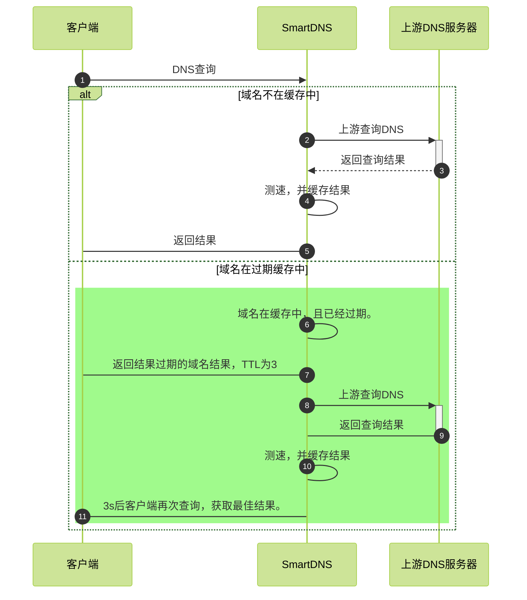

---
hide:
  - toc
---

# 缓存

SmartDNS提供了缓存能力，开启缓存的情况下，能提供更好的DNS查询请求；smartdns提供的过期缓存功能会将体验更进一步提升。

## 缓存配置

SmartDNS可以通过`cache-size`配置缓存的条数，同时也可以通过`cache-persist`来配置是否持久化缓存，也可以通过`cache-file`来指定缓存文件存储路径

```shell
cache-size 32768
cache-persist yes
cache-file /path/to/cache/file
```

注意：

  1. smartdns默认自动根据磁盘空间是否启用缓存。
  1. 缓存文件只有在进程正常退出的时候才会保存供下次使用。

## 缓存预获取

Smartdns可以设置缓存预获取，避免缓存超时，配置预先获取后，smartdns将在域名超时前的5s内，重新进行域名查询。并对域名的热度进行排序。

```shell
prefetch-domain yes
```

注意：

  1. 此功能将会导致smaratdns消耗更多的CPU。

## 过期缓存

过期缓存，也要乐观缓存，其功能指定是，当DNS域名的TTL到0时，其结果仍然存储在缓存中，等下次查询时，仍然将缓存的结果返回给客户端，避免客户端等待。乐观缓存的前提时，DNS的对应的IP地址不会频繁变化。

具体乐观缓存的原理可以参考(RFC 8767) (https://www.rfc-editor.org/rfc/rfc8767)

smartdns过期缓存处理流程



## 配置步骤

1. 开启过期缓存

  ```shell
  serve-expired yes
  ```

1. 配置过期缓存超时时间

  此时间表示过期缓存多长时间未访问，则从缓存中释放。

  ```shell
  serve-expired-ttl 259200
  ```

1. 配置过期缓存响应TTL

  此时间表示当缓存中域名TTL超时时，返回给客户端的TTL时间，让客户端在下列TTL时间后再次查询。

  ```shell
  serve-expired-reply-ttl 3
  ```

1. 过期缓存预获取时间

  此时间表示，过期缓存在多长时间未访问，主动进行预先获取，以避免IP无效；开启过期缓存后，prefetch的功能将和未开启不同。

  ```shell
  prefetch-domain yes
  serve-expired-prefetch-time 21600
  ```
