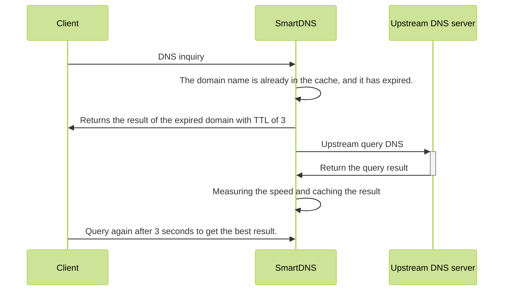

---
hide:
  - toc
---

# Cache

SmartDNS provides caching capabilities. With caching enabled, it can provide better DNS query requests. The expiration cache feature provided by smartdns will further improve the experience.

## Cache Configuration

SmartDNS can configure the number of caches through `cache-size`. It can also configure whether to persist the cache through `cache-persist` and can specify the cache file storage path through `cache-file`.

```shell
cache-size 32768
cache-persist yes
cache-file /path/to/cache/file
```

Note:

  1. SmartDNS enable cache according to disk space by default.
  1. Cache files will only be saved for next use when processes exited normally.
  1. Cache size `cache-size` usually does not need to be set. SmartDNS will automatically set it based on the system memory situation.

## Cache prefetch

SmartDNS can be set to prefetch cache to avoid cache timeout. After configuring prefetch, SmartDNS will re-query the domain name within 5 seconds before the domain name expires. And sort the popularity of domain names.

```shell
prefetch-domain yes
```

Note:

  1. This feature will cause SmartDNS to consume more CPU.

## Expired cache

Expired cache, also called optimistic cache, specifies that when the TTL of the DNS domain name reaches 0, its result is still stored in the cache, and the cached result is returned to the client next time it queries to avoid waiting for the client. The premise of optimistic caching is that the corresponding IP address of DNS will not change frequently.

The specific principle of optimistic caching can refer to (RFC 8767) (https://www.rfc-editor.org/rfc/rfc8767)

The process for SmartDNS to handle expired cache is as follows:



Through the above sequence diagram, it can be seen that when the cache expires, SmartDNS still sends the expired IP address to the client so that the client can quickly connect to the server. The premise of this mechanism is that the server IP address has not changed.

In reality, in most cases, after modifying the domain name IP address, it will not take effect immediately for thousands of households, because the global domain name system may take up to 72 hours to complete the refresh after IP changes domain. Even if the IP address in the expired cache appears to be faulty, SmartDNS returns the TTL of the expired IP to the client only for 3 seconds. After 3 seconds, the client will use the new IP again, which may require refreshing the page and retrying once in the client application. In addition, SmartDNS can set prefetch to avoid this problem as much as possible according to the implementation scenario.

Therefore, it is a good practice to enable expired cache in the main scenario.

## Configuration steps

1. Enable expired cache

    ```shell
    serve-expired yes
    ```

1. Configure the expired cache timeout

    This time indicates how long the expired cache has not been accessed, and it is released from the cache.

    ```shell
    serve-expired-ttl 259200
    ```

1. Configure the expired cache response TTL

    This time indicates the TTL time returned to the client when the domain name TTL in the cache expires, allowing the client to query again after the following TTL time.

    ```shell
    serve-expired-reply-ttl 3
    ```

1. Expired cache prefetch time

    This time indicates how long the expired cache has not been accessed, and initiates prefetch proactively to avoid invalid IPs. After enabling expired cache, the prefetch function will be different from disabling it.

    ```shell
    prefetch-domain yes
    serve-expired-prefetch-time 21600
    ```

## Disable cache for specific domains

1. In some cases, it may be necessary to disable caching for specific domains, such as DDNS. The following configuration can be used to disable it.

    ```shell
    domain-rules /example.com/ -no-cache
    ```

## Set cache save interval

1. To avoid losing the cache due to system or process restart, you can configure SmartDNS to periodically save the cache file.

    ```shell
    cache-checkpoint-time 86400  
    ```
