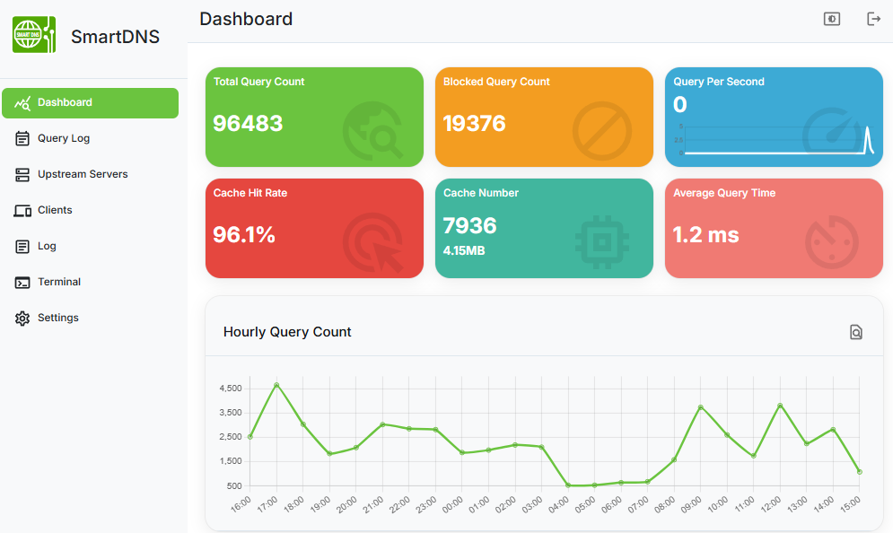

---
hide:
    - toc
---

# SmartDNS Dashboard

SmartDNS provides a web based dashboard feature that can be enabled by installing the dashboard plugin separately.



## Enabling the SmartDNS Dashboard

1. Configure the `plugin` parameter as shown below:

    ```shell
    # Enable the dashboard
    plugin smartdns_ui.so
    # Set the server port.
    smartdns-ui.ip http://[::]:6080
    ```

    Note:

    * The default username and password is: **`admin/password`**.   
    * The dashboard uses a plugin mechanism. If the SmartDNS program is statically compiled, the dashboard plugin is not supported.

1. Set the data file storage path using the `data-dir` parameter:

    ```shell
    data-dir /var/lib/smartdns
    ```

1. Enable HTTPS service:

    Use the `https://` prefix in the `smartdns-ui.ip` parameter to enable HTTPS.

    ```
    # Enable HTTPS service
    smartdns-ui.ip https://[::]:6080

    # Specify certificate files
    bind-cert-file /path/to/ca-file
    bind-cert-key-file /path/to/ca-key-file
    ```

    Note:

    * When HTTPS is enabled and no certificate files are specified, SmartDNS will automatically generate a root certificate file with `CN` as `SmartDNS Root` and the related certificate chain. 
    * You can add this root certificate to your trusted domain to enable secure access.

1. Set the maximum retention time for query logs:

    Use `smartdns-ui.max-query-log-age` to set the maximum retention time for query logs.

    ```shell
    # Set the maximum query log retention time in seconds
    smartdns-ui.max-query-log-age 86400
    ```

For more configuration options, refer to the [Configurations](../configuration.md) page.
